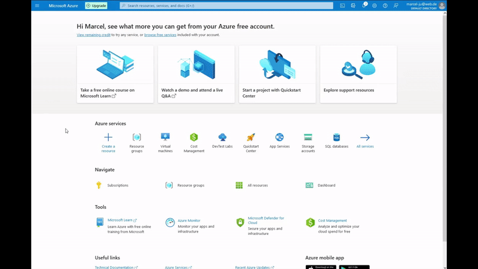
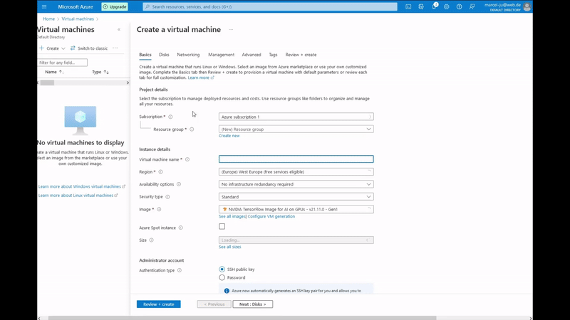
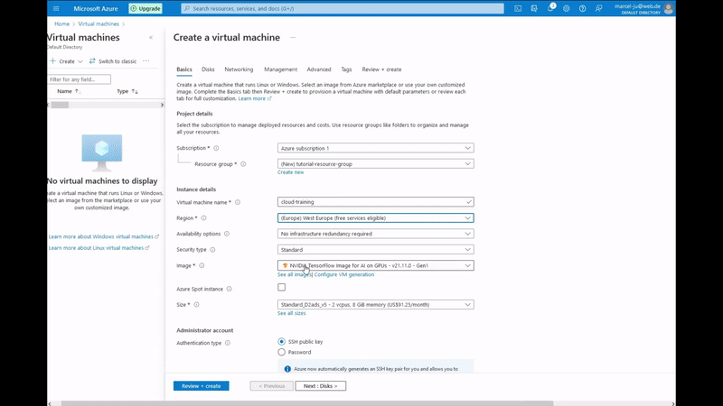
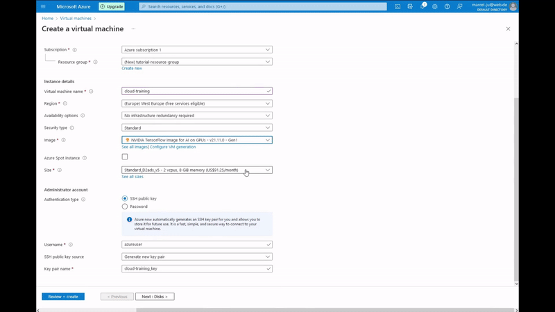
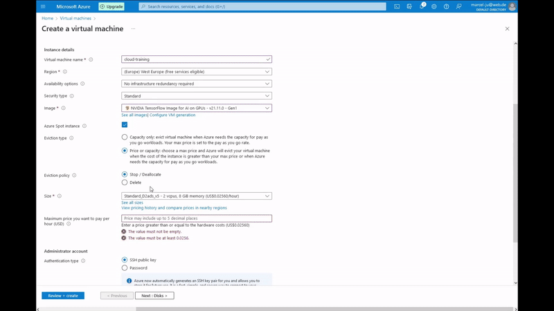
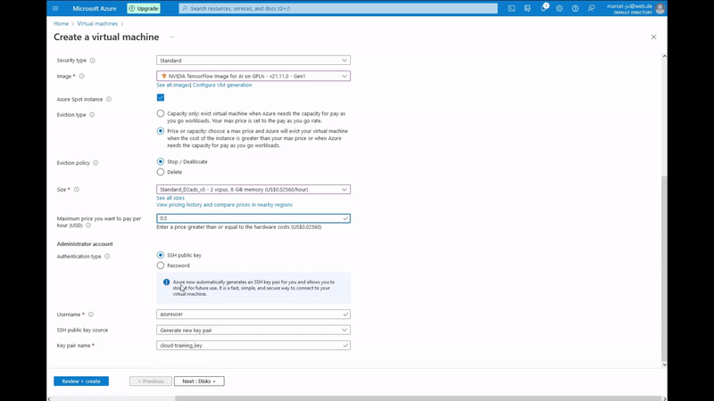
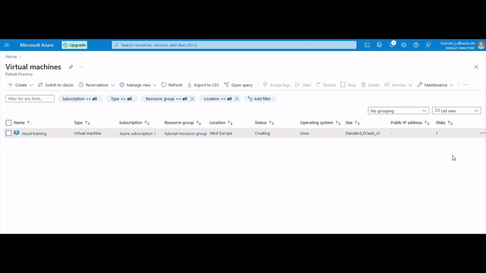
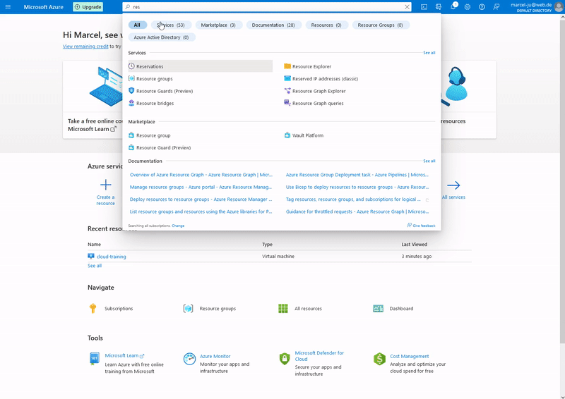

# CloudTraining
This is a tutorial on training machine learning models on Azure spot instances as part of the KTH DevOps 2022 course.

Training a machine learning (ML) model is one of the core components of MLOps, e.g. for continuous deployment. However, training a model can require high-end hardware resources over many days which in turn leads to high monetary costs. Spot instances on cloud platforms like Azure are servers that can be rented for usually 10% to 25% of the original price. As a downside, access to the instance may be withdrawn at any point after a 30 second notice. Model training can take advantage of spot instances by checkpointing the training state so that training can be resumed from a checkpoint after termination and restart of the server.

In this tutorial we lead you through the process of writing code for model training with checkpointing, containerizing the application and running it on an Azure spot instance in way that training resumes after a random restart. We will be using [Tensorflow](https://www.tensorflow.org/) with [Keras API](https://keras.io/about/) to build an artificial neural network (ANN), as these usually require high computational costs and long training times. Tensorflow is a free and open-source software library for machine learning and artificial intelligence with particular focus on building deep neural networks. Keras is a high level library built on top of TensorFlow for quickly building deep learning models. It was developed with a focus on enabling fast experimentation and ease of use. Furthermore, we use [Keras callbacks](https://keras.io/api/callbacks/) which are functions that are executed after various stages of training (e.g. every [epoch](https://radiopaedia.org/articles/epoch-machine-learning)). They are particularly helpful to create checkpoints to resume from.

The tutorial consists of six subsections:
1. Creating a training script with checkpointing
2. Building a Docker container
3. Creating a Virtual Machine on Azure
4. Setting up the VM
5. Model Training
6. Cleanup

You have the option to write the Python code and containerize it yourself. If you want to do that, we recommend using the [Docker Playground](https://www.katacoda.com/courses/docker/playground) on Katacoda. Otherwise, you may use our already built Docker images for running on the VM and start actively engaging the tutorial from section 3 - Creating a Virtual Machine on Azure. The tutorial consists of parts that are executed in a terminal (Katacoda recommended) and direct interaction with the Azure portal UI. 

### Creating a training script with checkpointing

Let us now look at how to create the training script. We will train an image classifier that aims to distinguish between pictures of [humans and horses](https://www.tensorflow.org/datasets/catalog/horses_or_humans) (a well-known human weakness). There are four main steps to the training script:

1.  Load your dataset of interest.
2.  Specify the checkpointing callback function that is periodically called during training.
3.  On startup, check if a checkpointed model already exits 
4.  Resume training if model exists (and update log file), otherwise begin training (and create log file)


We will use the log file to understand what is going on within the VM. For our training script example, we are going to use Tensorflow with Keras API to build a Convolutional Neural Network (CNN). It is sufficient to know that a CNN is a model that is learned from data to predict an output given an input (e.g. the labels horse / human given a picture). Different architectures for such models are possible, but for simplicity we use a predefined one. The [MobileNetV3Small](https://www.tensorflow.org/api_docs/python/tf/keras/applications/MobileNetV3Small) architecture has over a million parameters to learn which makes the learning process long enough to profit from checkpointing. Any other model architecture and any other dataset than the [horses_or_humans](https://www.tensorflow.org/datasets/catalog/horses_or_humans) one may be used.

The dataset can be loaded and split into a training set and a validation set using:

```python
(train_ds, val_ds) = tfds.load(name='horses_or_humans', split=['train', 'test'],
                               as_supervised=True, batch_size=32)                           
```

Next, we specify the callback that periodically creates a checkpoint of the Keras model with the function [ModelCheckPoint](https://www.tensorflow.org/api_docs/python/tf/keras/callbacks/ModelCheckpoint). A verbose description of the parameter setting can be found in the linked documentation of the function.

```python
checkpoint = tf.keras.callbacks.ModelCheckpoint(
    filepath=os.path.join(os.getcwd(), 'Saved_Model', 'Models.{epoch}-{val_loss:.2f}.hdf5'),
    monitor='val_loss',
    verbose=0,
    save_best_only=False,
    save_weights_only=False,
    mode='min',
    save_freq='epoch',
    period=5,
    options=None,
    initial_value_threshold=None,
)                           
```
The 'filepath' parameter specifies that the model should be saved in a folder 'Saved_Model', which we presume already exists, because we will create it in the next section inside the container. When specifying the name of the saved model, 'Models.{epoch}-{val_loss:.2f}' in our case, it is important to include the .{epoch} part as this will later on be used to inform us on the epoch number when our model gets terminated. We also saved the file using the '.hdf5' extension such that the whole model is contained in a single file. Finally, the callback is triggered every `period=5` epochs.

Next we have to check whether a model already exists and potentially resume training from it. If it exists, we extract the epoch number with a regular expression from the filename and then load the model to continue training from this epoch.

```python
# If model(s) already exists, continue training
if len(os.listdir(os.path.join(os.getcwd(), 'Saved_Model'))) > 1:

    # Regular expression pattern to extract epoch number
    pattern = '[^0-9]+([0-9]+).+'
    filenames = os.listdir(os.path.join(os.getcwd(), 'Saved_Model'))

    # Find epoch number
    max_epoch = -1
    max_epoch_filename = None
    for filename in filenames:
        regexp_match_list = re.findall(pattern=pattern, string=filename)

        # If curr file is log.txt no match
        if len(regexp_match_list) == 0: continue

        last_epoch = int(regexp_match_list[0])
        if last_epoch > max_epoch:
            max_epoch = last_epoch
            max_epoch_filename = filename

    filename = max_epoch_filename

    # Load model and continue training model from last epoch
    checkpoint_path = os.path.join(os.getcwd(), 'Saved_Model', filename)
    model = load_model(filepath=checkpoint_path)
    model.fit(x=train_ds, epochs=70, validation_data=val_ds, callbacks=[checkpoint], initial_epoch=max_epoch)                  
```

If no model exists (i.e no training has been done yet), we simply define our model with the MobileNetV3Small architecture, compile it and then fit it to the data for training for 70 epochs/iterations.

```python
else:
    model = tf.keras.applications.MobileNetV3Small(
        input_shape=(300, 300, 3),
        alpha=1.0,
        minimalistic=False,
        include_top=True,
        weights=None,
        input_tensor=None,
        classes=2,
        pooling=None,
        dropout_rate=0.2,
        classifier_activation='softmax',
    )

    model.compile(optimizer='adam', loss=tf.keras.losses.SparseCategoricalCrossentropy(from_logits=False),
                  metrics=['accuracy'])

    model.fit(x=train_ds, epochs=70, validation_data=val_ds, callbacks=[checkpoint], initial_epoch=0)               
```

Now, whenever our training gets interrupted the script will simply refer to the 'Saved_Model' file and just reload the model from where it left off.

Check out the [main.py](https://github.com/Neproxx/cloud-training/blob/main/main.py) in the repository to see the whole training script. We also added a log file in the script to keep track of the training process.

### Building a Docker container

After creating your training script, the next step is to create what is called a 'container'. A container is a unit of software that packages up all the code and dependencies required to run your application (in this case the training script). To do this, we will use [Docker](https://www.docker.com/) which is a popular open platform for delivering software applications using containers.

Docker consists of two main components:

1. [Docker Engine](https://docs.docker.com/engine/) - This is the packaging tool used to build and run container images (a container is simply a running image)
2. [Docker Hub](https://docs.docker.com/docker-hub/) - This is a cloud service for sharing your applications (which we will use to download the container image on the VM)

To build the container image, we have to create a [Dockerfile](https://docs.docker.com/engine/reference/builder/) which contains the instructions on how to build the container image. For our training script, the Dockerfile looks like this:


```dockerfile
FROM tensorflow/tensorflow

WORKDIR /app

COPY . .

# Install dependencies
RUN pip install tensorflow_datasets && \
    mkdir Saved_Model

CMD ["python", "main.py"]                    
```

The individual commands do the following:
1. Inherits the tensorflow image from Dockerhub as we require tensorflow in our application
2. Creates and sets the working directory inside the container to the folder '/app'
3. Copy the required files from our host machine into the '/app' folder (the current working directory) 
4. Install the 'tensorflow_datasets' python library as we use this to obtain the dataset for the training script. Create a 'Saved_Model' folder we will store our model checkpoints.
5. Run our training script 'main.py' when the container is started.

You can then build the container image from the Dockfile using your terminal by (where path refers to the directory containing the Dockerfile). If you do not name your file "Dockerfile", you will have to specify the name with the -f flag. The image name is relevant for uploading it to Dockerhub, so please first read the explanations further below before executing this command.

```console
docker build -t name_of_image <path>
```
You can then view your created container images using:

```console
docker image ls
```

To push your image to Dockerhub, you must first open a [Dockerhub repository](https://docs.docker.com/docker-hub/repos/). In order to upload your image, you must give the image a name that contains your Docker Hub username followed by the repository name that you created through Docker Hub on the web. It has the form `<hub-user>/<repo-name>`. Finally, you can push the image to Dockerhub using:

```console
docker push <hub-user>/<repo-name>
```


### Creating a VM
After we have built our application, we need to run it on a server. Azure offers to spin up a VM on a server that can host our application. It is possible to do this programmatically, however, since this is a tutorial, it is easier and safer to use the UI in the webbrowser that informs you about prices, etc... Login to the [Azure portal](https://portal.azure.com/) and start creating a VM as shown below.



First of all, we need to create a resource group that groups all related components of an application together. This is very useful, as many resources will be created implicitly and you will only know about them and find them by investigating the resource group. A VM for example requires disk space and an IP address which both represent implicitly created resources. When you want to delete your application, you can find all of them inside your resource group. We create a resource group named "tutorial-resource-group". If you decide to choose your own names, you will have to adapt some of the code later in the tutorial.



Next up, we need a VM image to run on our new server. For us, it is important that it has Docker installed so that we can start the Docker container when the system boots up. The tensorflow image from Nvidia fits our purposes.



We tick the "spot instance" box and notice that prices go down by 80% to 90%. We can select an eviction policy that is either solely based on capacity, meaning that Azure will terminate our instance when they require the hardware capacity, or additionally if it exceeds our price limit. Prices for cloud servers are dynamic and thus it is reasonable to evict a machine once it passes a specific price limit. You may set it to 0.5$ for example. 



Most of our costs will be determined by the server size / hardware we select. In a real use case, we would select a large server with GPUs in order to speed up model training. For educational purposes however, it is sufficient to select a small server that is covered by Azure's free plan.



Finally, enter a user name and a key pair name for ssh authentication. This will not be needed in the scope of the tutorial, but you could use these credentials to connect to the VM. Click on Review + create and see how your VM instance is created. If you plan on using ssh, you find instruction on how to connect by navigating to the VM in the azure portal and finding the "connect" tab. This [video](https://youtu.be/3Ecm90UZHv0?t=105) illustrates the process, however, make sure to specify the key path when copying the ssh command as the video author does. You may also use the ssh terminal instead of the Azure CLI in the next section. However, when it comes to starting, orchestrating and terminating instances, you would usually use the Azure CLI.



### Setting up the VM
In the last section, we have created a VM, but by default it will not do anything. Therefore, we need to download the Docker image we created, start it and tell the VM that in case of a termination and re-boot, it should run the container again. In this tutorial, we use the Azure CLI to do that. You can either install the Azure CLI for your OS or run a docker container that already has it installed. We do the latter by launching such a container with the command below. 

```console
docker run -it mcr.microsoft.com/azure-cli bash
```

Note that "-it ... bash" tells docker to glue our terminal to the container and start bash inside of it so that we can interact with the container. On the other hand "mcr.microsoft.com/azure-cli" is the image name that is provided by Microsoft and downloaded from [dockerhub](https://hub.docker.com/_/microsoft-azure-cli). Once the container is up and running, login by following the instructions inside the terminal. You may instead run the next few commands directly on the VM via ssh. In that case you would not need to login to Azure, but you would have to adapt the following commands.

```console
az login
```

Since we are using spot instances, our VM may be shut down or restarted at any point in time. Therefore, we have to make sure that the container always starts on bootup and continues training. We now create an executable script in the folder "/tutorial", which starts the container, as well as a log file in the folder "/tutorial/models". Replace the image name in the docker container run line with your own image name if you built it yourself and pushed it to dockerhub.

```console
az vm run-command invoke -g tutorial-resource-group -n cloud-training --command-id RunShellScript --scripts "
mkdir /tutorial
mkdir /tutorial/models
touch /tutorial/models/log.txt
touch /tutorial/startup-script.sh
cat <<EOF > /tutorial/startup-script.sh
#\!/bin/bash
docker container run -v /tutorial/models:/app/Saved_Model miltonius/cloud_trainingv2 
EOF
chmod +x /tutorial/startup-script.sh"
```

The syntax "cat <\<EOF > file_name my-script-code EOF" is commonly used to push a multiline string into a file. In addition, we need to explicitly tell the os with "chmod +x" that the file is allowed to be executed. We use a -v flag to create a [bind mount](https://docs.docker.com/storage/bind-mounts/). This makes the host folder specified on the left (/tutorial/models) accessible inside the container under the path stated on the right (/app/Saved_Model). Thus, we can store models under the path "/app/Saved_Model" inside the container and files will appear under "/tutorial/models/" on the VM host. Note that Azure provides an approach within the Webbrowser to execute on a VM which you might prefer. For simplicity we stick to the Azure CLI.

After we have created a script that starts the container, we need to execute it on every bootup. The cronjobs package suits our purposes, as it executes jobs / scripts on a periodic schedule. In our case, we specify our schedule with the string "@reboot". Since the syntax can be hard to comprehend, the [crontab-generator](https://crontab-generator.org/) is very useful to generate the cronjob. The script that is executed below can be summarized as "Store all current cronjobs to cron_bkp (a temporary file), add a new cronjob to cron_bkp, schedule all the cronjobs that are now in cron_bkp, delete the file cron_bkp". It may be the case that you get the stderr output "no crontab for root" which you can ignore, because the crontab gets created with this script.

```console
az vm run-command invoke -g tutorial-resource-group -n cloud-training --command-id RunShellScript --scripts "
sudo crontab -l > cron_bkp
sudo echo '@reboot sudo /tutorial/startup-script.sh >/dev/null 2>&1' >> cron_bkp
sudo crontab cron_bkp
sudo rm cron_bkp"
```

### Model Training
It is time to train a model on our VM. We can either start the script directly or reboot and let the machine start the script by itself. Let us first start the script directly.

```console
az vm run-command invoke -g tutorial-resource-group -n cloud-training --command-id RunShellScript --scripts "
/tutorial/startup-script.sh"
```

The model is now training. If you want to see the progress live you can login to the server with ssh, find the container's id with

```console
docker container ls 
```

and then watch the prints of the container (and thus the training progress) with:

```console
docker container logs -f <container-id> 
```

If you do not want to do this, just wait 5 minutes to make sure that some training progress was made (at least two epochs of training). We now want to simulate an eviction / termination of the machine. Unlike AWS, Azure does not give us any non-hacky way of automatically restarting the VM after eviction. In order to keep this tutorial simple, we will thus manually restart the VM. The easiest way to do this is to use the webbrowser UI. You can check the status of the machine by clicking on refresh. The restarting process might take a couple of minutes.
  
  

Alternatively, you can use the Azure CLI:

```console
az vm restart --name cloud-training --resource-group tutorial-resource-group
```
  
After the machine has restarted, you can check the log that the python script creates to see that it has resumed from a checkpoint:

```console
az vm run-command invoke -g tutorial-resource-group -n cloud-training --command-id RunShellScript --scripts "
cat /tutorial/models/log.txt"
```

We obtain the following output on the Azure CLI:
  
  

We can see when the training began at 23:15, but at 23:30 training resumed after a restart and began at epoch 11. Thus, training resumed from a checkpoint and does not start from scratch.

### Cleanup
Cleaning up our resources is important for billing purposes and made easy, as we can simply go to resource groups and delete both groups that we find there. It does take a while until Azure has removed all services, so you naturally have to wait 1-3 minutes until everything is gone.




### Further Notes
In this tutorial, we stored the model on the VM directly. In reality you would prefer to put it in some more persistent cloud storage like an AWS S3 bucket. If you want to use this approach to reduce costs of model training, we advise you to use AWS which is much better suited for it. For example, it gives you an option to automatically request a new spot instance once AWS has capacities available (see [spot requests](https://docs.aws.amazon.com/AWSEC2/latest/UserGuide/spot-requests.html)). In order to conform with KTH however, we developed this tutorial using Azure.
